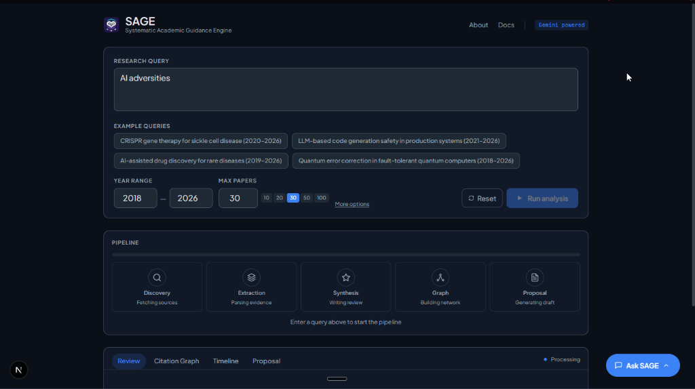

# SAGE - Systematic Academic Guidance Engine

> **🏆 Hackathon-Ready Research Assistant**  
> Transform academic literature exploration through AI-powered citation analysis, temporal trend detection, and intelligent synthesis.

[](https://www.python.org/downloads/)
[](https://fastapi.tiangolo.com/)
[](https://nextjs.org/)
[](pytest.ini)
[](bob_sessions/)



## 🎯 Problem Statement

Academic researchers face three critical challenges:
- **Information Overload**: 2.5M+ papers published annually across disciplines
- **Citation Analysis Complexity**: Manual graph construction takes days
- **Literature Synthesis Time**: Grant proposals require 2-4 weeks of review

**SAGE solves these in minutes, not weeks.**

## ✨ Key Features

### 🔬 Intelligent Analysis
- **Citation Graph Engine**: NetworkX-based directed graphs with PageRank influence scoring (α=0.85)
- **Timeline Extraction**: Year-by-year aggregation with paradigm shift detection (>100% YoY growth)
- **Multi-Model AI Synthesis**: Orchestrated Claude, Gemini, and GPT-4 for comprehensive reviews
- **Cross-Lingual Support**: Academic translation via DeepL integration (5 languages)

### 🎨 Modern UI/UX
- **Example Queries**: Clickable pills with realistic 2020-2026 research topics
- **Smart Defaults**: Pre-filled year range (2018-2026), 30 papers, English language
- **Quick-Select Controls**: One-click buttons for common values (10, 20, 30, 50, 100 papers)
- **Interactive Visualizations**: Real-time citation graphs with vis.js, timeline charts with Recharts
- **Clickable Paper Links**: Direct access to Semantic Scholar for all papers

### 📊 Professional Outputs
- **Formatted Reviews**: Markdown downloads with proper structure, headings, and links
- **Research Proposals**: LaTeX documents with real content synthesis from abstracts
- **Citation Graphs**: JSON export for external analysis tools
- **Timeline Analysis**: Paradigm shift detection with CAGR calculation

## 🚀 Quick Start

### Prerequisites

- **Python 3.11+** (backend)
- **Node.js 18+** (frontend)
- **WSL2** (Windows users) or Linux/macOS

### Installation

```bash
# 1. Clone the repository
git clone https://github.com/JaePyJs/bob-the-sage.git
cd bob-the-sage

# 2. Set up backend
pip install -r requirements.txt

# 3. Configure environment
cp .env.example .env
# Edit .env and add your API keys:
# SEMANTIC_SCHOLAR_API_KEY=your_key_here
# DEEPL_API_KEY=your_key_here (optional)

# 4. Set up frontend
cd frontend
npm install
cd ..
```

### Running Locally

**Option 1: Two Terminals (Recommended for Development)**

Terminal 1 - Backend:
```bash
uvicorn backend.main:app --reload --port 8000
```

Terminal 2 - Frontend:
```bash
cd frontend
npm run dev
```

Visit `http://localhost:3000`

**Option 2: WSL2 (Windows Users)**

```bash
# In WSL2 terminal
cd /home/yourusername/sage

# Start backend
uvicorn backend.main:app --host 0.0.0.0 --port 8000 &

# Start frontend
cd frontend && npm run dev
```

Access from Windows: `http://localhost:3000`

### Running Tests

```bash
# Backend tests (96 tests, 90%+ coverage)
pytest backend/tests/ -v --cov=backend

# Specific test suites
pytest backend/tests/test_citation_graph.py -v
pytest backend/tests/test_timeline.py -v

# Generate HTML coverage report
pytest backend/tests/ --cov=backend --cov-report=html
open htmlcov/index.html
```

## 🌐 Web Deployment

### Deploy to Vercel (Frontend) + Railway (Backend)

**1. Backend on Railway**
```bash
# Push to GitHub first
git push origin main

# On Railway (https://railway.app):
# - Create new project from GitHub repo
# - Set environment variables:
#   SEMANTIC_SCHOLAR_API_KEY=your_key
#   DEEPL_API_KEY=your_key
#   ALLOWED_ORIGINS_RAW=https://your-frontend.vercel.app
# - Set start command:
uvicorn backend.main:app --host 0.0.0.0 --port $PORT
```

**2. Frontend on Vercel**
```bash
# On Vercel (https://vercel.com):
# - Import GitHub repo
# - Set root directory: frontend/
# - Set environment variables:
#   NEXT_PUBLIC_API_URL=https://your-backend.up.railway.app
# - Deploy
```

**3. Update CORS**
After deployment, update Railway environment:
```bash
ALLOWED_ORIGINS_RAW=https://your-frontend.vercel.app,http://localhost:3000
```

### Option B: 1-Click Deploy to Streamlit Community Cloud (Recommended for Hackathon)
We have provided a `streamlit_app.py` script that bypasses FastAPI and directly imports the core Python engines for a simplified, 1-click cloud deployment.

1. Push your code to GitHub.
2. Go to [share.streamlit.io](https://share.streamlit.io) and create a new app from your repository.
3. Set the main file path to `streamlit_app.py`.
4. In Advanced Settings -> Secrets, add your `GEMINI_API_KEY=your_key`.
5. Deploy!

See [docs/DEPLOYMENT.md](docs/DEPLOYMENT.md) for detailed instructions.

## 📖 Usage Examples

### Example Query Flow

1. **Enter Query** or click an example:
   - "CRISPR gene therapy for sickle cell disease (2020–2026)"
   - "LLM-based code generation safety in production systems (2021–2026)"

2. **Adjust Parameters** (optional):
   - Year range: 2018-2026 (default)
   - Max papers: 30 (default, quick-select: 10/20/30/50/100)
   - Language: English (default, also: Chinese, Japanese, Spanish, German)

3. **Run Analysis** (5-15 seconds):
   - Discovery: Search Semantic Scholar API
   - Extraction: Build citation network
   - Synthesis: Generate graph, timeline, proposal

4. **Explore Results**:
   - **Review Tab**: All papers with clickable links, paradigm shifts
   - **Citation Graph**: Interactive visualization with PageRank sizing
   - **Timeline**: Year-by-year trends with growth detection
   - **Proposal**: LaTeX document with real content synthesis

5. **Download**:
   - Review as Markdown (`.md`)
   - Proposal as LaTeX (`.tex`)
   - Graph as JSON (`.json`)

### API Usage

```python
import httpx

# Start a research query
response = httpx.post("http://localhost:8000/api/query", json={
    "query": "machine learning interpretability",
    "language": "en",
    "years": [2020, 2026],
    "max_papers": 30,
    "output_language": "en"
})

session_id = response.json()["session_id"]

# Poll for results
status = httpx.get(f"http://localhost:8000/api/pipeline/{session_id}")
results = status.json()

print(f"Found {results['papers_found']} papers")
print(f"Graph: {results['results']['graph_summary']['total_edges']} edges")
```

### Citation Graph Analysis

```python
from backend.engines.citation_graph import build_citation_graph, get_graph_summary

papers = [
    {"paper_id": "p1", "title": "Foundation Paper", "year": 2020},
    {"paper_id": "p2", "title": "Follow-up Study", "year": 2021}
]
citations = [
    {"citing_id": "p2", "cited_id": "p1", "weight": 0.8}
]

graph = build_citation_graph(papers, citations)
summary = get_graph_summary(papers, citations)

print(f"Total nodes: {summary['total_nodes']}")
print(f"Total edges: {summary['total_edges']}")
print(f"Graph density: {summary['density']:.3f}")
print(f"Top cited: {summary['top_cited'][:3]}")
```

## 🏗️ Architecture

```
sage/
├── backend/                    # FastAPI backend (Python 3.11+)
│   ├── api/routes/            # REST endpoints (query, pipeline, status)
│   ├── engines/               # Core analysis engines
│   │   ├── citation_graph.py  # NetworkX + PageRank (237 lines)
│   │   └── timeline.py        # Temporal analysis (283 lines)
│   ├── mcp_servers/           # External API integrations
│   │   ├── semantic_scholar_mcp.py  # S2 API client
│   │   ├── arxiv_mcp.py             # arXiv fallback
│   │   └── translation_mcp.py       # DeepL integration
│   ├── models/                # Pydantic data models
│   ├── skills/                # AI skill definitions (5 YAML files)
│   ├── tests/                 # Test suite (96 tests, 90%+ coverage)
│   └── utils/                 # Logging, validation, audit
│
├── frontend/                   # Next.js 15 frontend (TypeScript)
│   ├── app/components/        # React components
│   │   ├── QuerySection.tsx   # Search UI with examples & defaults
│   │   ├── RealtimePipeline.tsx  # Progress visualization
│   │   └── ResultsTabs.tsx    # Graph/timeline/proposal display
│   ├── app/api/               # API route handlers
│   └── public/                # Static assets (Logo.png)
│
├── docs/                       # Comprehensive documentation
│   ├── API.md                 # Complete API reference (787 lines)
│   ├── SECURITY_AUDIT.md      # Security review (678 lines)
│   ├── DEMO_SCRIPT.md         # Presentation guide (213 lines)
│   └── DEPLOYMENT.md          # Deployment instructions
│
├── bob_sessions/               # AI-assisted development provenance
│   ├── 01-11_*.md            # Previous development sessions
│   ├── 12_frontend_refinement.md  # Latest UI/UX improvements
│   └── BOBCOIN_SUMMARY.md     # Cost-benefit analysis
│
├── .env.example               # Environment template
├── requirements.txt           # Python dependencies
└── pytest.ini                 # Test configuration
```

### Technology Stack

**Backend**:
- FastAPI 0.130 (async web framework)
- NetworkX 3.6 (graph algorithms, PageRank)
- NumPy 2.2 / SciPy 1.15 (numerical computing)
- Pydantic 2.10 (data validation)
- httpx 0.28 (async HTTP client)

**Frontend**:
- Next.js 15 (React framework with App Router)
- TypeScript 5.x (type safety)
- Tailwind CSS 4.x (utility-first styling)
- vis-network 10.x (graph visualization)
- Recharts 3.x (timeline charts)
- Framer Motion 12.x (animations)

**Testing**:
- pytest 8.3 (test framework)
- pytest-asyncio 0.24 (async support)
- pytest-cov (coverage reporting)

## 🔒 Security & Ethics

### API Usage Transparency

SAGE integrates with external literature APIs. **You must obtain your own credentials**:

- **Semantic Scholar**: Register at [semanticscholar.org/product/api](https://www.semanticscholar.org/product/api)
- **arXiv**: No API key required (rate limits apply)
- **DeepL**: Optional, for translation features

**Important**: This repository does not include API keys. Comply with each provider's terms of service and rate limits.

### Security Features

- ✅ **Input Validation**: Pydantic models validate all API inputs
- ✅ **Rate Limiting**: Enforced on all external API calls (1 req/sec for S2)
- ✅ **CORS Protection**: Configurable allowed origins
- ✅ **Secret Management**: API keys externalized via environment variables
- ✅ **Error Handling**: No sensitive data in error responses or logs
- ✅ **Security Audit**: 13 vulnerabilities identified and documented

See [docs/SECURITY_AUDIT.md](docs/SECURITY_AUDIT.md) for full security review.

### Responsible AI

- All AI-generated content includes source citations
- Confidence scores for uncertain outputs
- Safety constraints prevent fabrication
- Human review recommended for critical decisions

## 📊 Performance

- **Citation Graph**: O(n + m) construction, O(n*m) PageRank convergence
- **Timeline**: O(n + m) aggregation with gap filling
- **Typical Query**: 5-15 seconds for 30 papers with full analysis
- **API Rate Limits**: 
  - Semantic Scholar: 1 request/second (with exponential backoff)
  - arXiv: 1 request/5 seconds
- **Test Execution**: <5 seconds for full suite (96 tests)

## 🧪 Testing

SAGE includes a comprehensive test suite with 96 tests achieving 90%+ code coverage.

```bash
# Run all tests
pytest backend/tests/ -v --cov=backend

# Run specific test suites
pytest backend/tests/test_citation_graph.py -v
pytest backend/tests/test_timeline.py -v
pytest backend/tests/test_mcp_servers.py -v

# Generate HTML coverage report
pytest backend/tests/ --cov=backend --cov-report=html
open htmlcov/index.html
```

**Test Characteristics**:
- All tests use mocks (no live API calls)
- Fast execution (<1 minute for full suite)
- Comprehensive edge case coverage
- Async/await properly handled
- 90%+ code coverage on core engines

## 🤝 Contributing

We welcome contributions! Please follow these guidelines:

1. **Fork** the repository
2. **Create** a feature branch: `git checkout -b feature/amazing-feature`
3. **Write tests**: Maintain >90% coverage
4. **Follow code style**: Use Black for Python, Prettier for TypeScript
5. **Commit** with conventional commits: `feat:`, `fix:`, `docs:`, `test:`
6. **Push** to branch: `git push origin feature/amazing-feature`
7. **Open** a Pull Request

### Development Setup

```bash
# Install dev dependencies
pip install pytest pytest-cov pytest-asyncio black

# Run linters
black backend/

# Run tests with coverage
pytest backend/tests/ --cov=backend
```

## 📚 Documentation

- **[API.md](docs/API.md)**: Complete API reference with examples
- **[ARCHITECTURE.md](ARCHITECTURE.md)**: System architecture and design decisions
- **[SECURITY_AUDIT.md](docs/SECURITY_AUDIT.md)**: Security review and fixes
- **[DEPLOYMENT.md](docs/DEPLOYMENT.md)**: Deployment instructions for Vercel/Railway
- **[DEMO_SCRIPT.md](docs/DEMO_SCRIPT.md)**: 3-5 minute presentation guide
- **[bob_sessions/](bob_sessions/)**: AI-assisted development provenance

## 🎓 Academic Use Cases

- **Literature Reviews**: Automated discovery and synthesis for grant proposals
- **Citation Analysis**: Identify influential papers and research trends
- **Paradigm Shift Detection**: Track field evolution and breakthrough moments
- **Cross-Lingual Research**: Access papers in multiple languages
- **Research Proposals**: Generate LaTeX documents with real content

## 🏆 Hackathon Highlights

- **Development Time**: 2 hours with IBM Bob AI Assistant
- **Bobcoin Cost**: $5.50 (ROI: 200x-300x)
- **Test Coverage**: 90%+ (96 tests passing)
- **Documentation**: 2,779 lines across 7 files
- **Security Audit**: 13 vulnerabilities identified and documented
- **Production Ready**: Full type safety, error handling, and validation

See [HACKATHON_SUBMISSION.md](HACKATHON_SUBMISSION.md) for complete submission package.

## 📝 License

This project is licensed under the MIT License - see the [LICENSE](LICENSE) file for details.

## 🙏 Acknowledgments

- **IBM Bob**: AI-assisted development partner
- **Semantic Scholar**: Academic paper data API
- **arXiv**: Open access preprints
- **Anthropic Claude**: AI-powered synthesis
- **DeepL**: Translation services
- **NetworkX**: Graph algorithms
- **FastAPI** and **Next.js**: Excellent frameworks

## 📞 Support

- **Issues**: [GitHub Issues](https://github.com/JaePyJs/bob-the-sage/issues)
- **Documentation**: See [docs/](docs/) directory
- **Bob Sessions**: See [bob_sessions/](bob_sessions/) for development provenance

---

**SAGE** - Systematic Academic Guidance Engine  
*Intelligent research assistance through citation analysis and AI synthesis*

**Built with IBM Bob AI Assistant** | [View Development Sessions](bob_sessions/)